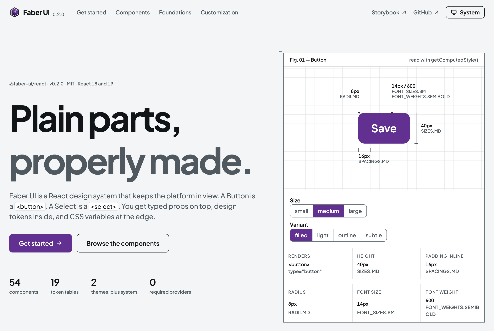

<p>
  <picture>
    <source media="(prefers-color-scheme: dark)" srcset="./assets/brand/faber-ui-horizontal-dark.svg" />
    
  </picture>
</p>

A React design system built on native elements, typed props, design tokens, and CSS variables.

[Website](https://faberui.vercel.app/) ·
[Storybook](https://faberui.vercel.app/storybook/) ·
[npm](https://www.npmjs.com/package/@faber-ui/react)

<picture>
  <source media="(prefers-color-scheme: dark)" srcset="./assets/readme/preview-dark.png" />
  
</picture>

## Why Faber UI

- **The native element is still there.** A `Button` is a `<button>`: it forwards attributes,
  events, and the ref to the real DOM node.
- **Typed all the way down.** Options are closed sets, and an icon-only button without an
  accessible name is a compile error.
- **Themes without React.** Light, dark, and system are CSS variables behind a `data-theme`
  attribute. No provider is required.
- **Open to change.** Every part has a stable class name, every token is a CSS variable, and
  components export their parts so you can assemble your own.

## Install

```bash
npm install @faber-ui/react styled-components
```

React 18 or 19 and styled-components 6 are peer dependencies. The packages are ESM only. Until
1.0, a minor version may change an API.

## Use

Load the theme variables and the bundled font once, at the entry of the application:

```tsx
import '@faber-ui/react/styles.css';
```

Then render components:

```tsx
import { Button, Field, Input, VFlex } from '@faber-ui/react';

export function InviteForm() {
  return (
    <form>
      <VFlex gap="MD">
        <Field label="Email" description="We only send the invitation.">
          <Input name="email" type="email" required />
        </Field>
        <Button type="submit">Send invitation</Button>
      </VFlex>
    </form>
  );
}
```

In the Next.js App Router, add the styled-components registry and the `compiler.styledComponents`
flag; the [getting started guide](https://faberui.vercel.app/docs/) shows both.

## Customize

```css
/* A brand color and a sharper radius, everywhere. */
:root {
  --faber-ui-color-primary: hsl(220 80% 46%);
  --faber-ui-radius-md: 2px;
}

/* One part of one component. */
.faber-ui-button-icon {
  opacity: 0.7;
}
```

Typed props, scoped themes, tokens in your own styles, and components rebuilt from exported parts
are covered in the
[customization guide](https://faberui.vercel.app/docs/customization/).

## Packages

| Package            | What it holds                                                        |
| ------------------ | -------------------------------------------------------------------- |
| `@faber-ui/react`  | The components. It re-exports the tokens and themes.                 |
| `@faber-ui/tokens` | Primitive and semantic design tokens.                                |
| `@faber-ui/themes` | Light and dark themes, their stylesheets, and the optional provider. |
| `@faber-ui/icons`  | Outline icons as React components.                                   |
| `@faber-ui/fonts`  | Plus Jakarta Sans as local font files.                               |

Most applications install only `@faber-ui/react`, and `@faber-ui/icons` when they need icons.

## Develop

Requirements: Bun `1.3.14` and Node.js `20.19.0` or newer.

```bash
bun install

bun run storybook   # component reference on port 6006
bun run website     # documentation site on port 3000

bun run lint
bun run typecheck
bun run test
bun run build
```

```text
apps/
  storybook/   Component guides and stories
  website/     Documentation site, built with the library
packages/
  react/       Components
  tokens/      Design tokens
  themes/      Themes and CSS variables
  icons/       Icons
  fonts/       Font assets
```

Work happens on `develop`; `master` deploys the website and starts a release. Add a changeset with
`bun run changeset` for every change to a published package. Report vulnerabilities as described
in [SECURITY.md](./SECURITY.md).

## License

[MIT](./LICENSE). The bundled Plus Jakarta Sans font files keep their own OFL-1.1 license.
