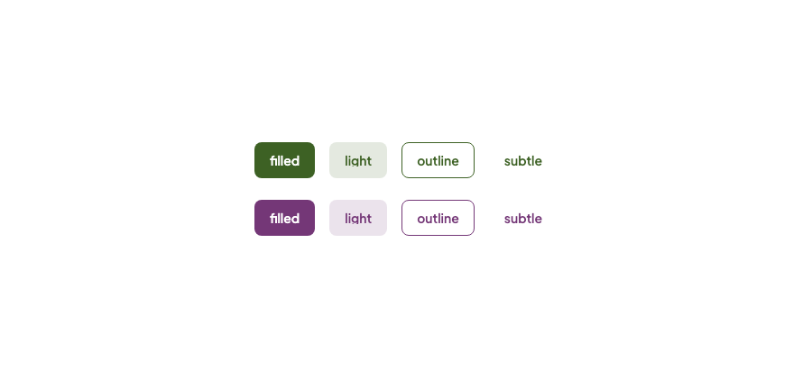
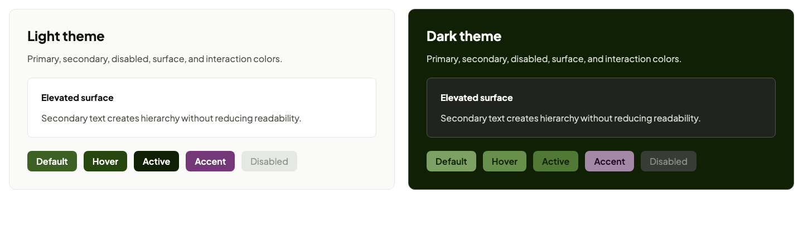

# Faber UI

Faber UI is a strongly typed design system for React applications built with TypeScript,
styled-components, design tokens, and Storybook. It supports React 18 and 19 and is designed for
projects using Next.js, Vite, or another modern ESM toolchain.

> [!NOTE]
> The documentation is under development.

## Foundations

- TypeScript with strict compiler settings.
- React 18 and 19 support.
- ESM-only packages built with Vite Library Mode.
- styled-components with the SWC transform.
- Radix primitives used internally for Tooltip, Popover, and Menu.
- External styled-components runtime with deterministic namespaced SSR identifiers and pure
  annotations for tree shaking.
- Primitive and semantic design tokens.
- Light and dark themes with CSS custom properties.
- Optional React `ThemeProvider` and `GlobalStyles`.
- Locally distributed Plus Jakarta Sans Variable font.
- Semantic HTML, native props, and forwarded refs.
- Vitest, Testing Library, jsdom, ESLint, and Prettier.
- Storybook Autodocs, MDX guides, and accessibility checks.
- Bun Workspaces and Turborepo.

## Customization model

The component APIs provide defined defaults without making the theme or provider mandatory. The
same interface can be adjusted at different levels depending on how much control is needed.

- **Component API:** typed props, presets, native HTML props, events, and refs.
- **Component composition:** `className`, `style`, styled-components wrappers, and `.attrs()`.
- **Runtime values:** public option constants or their equivalent typed string literals.
- **Visual foundations:** typed token objects reexported by `@faber-ui/react`.
- **Small theme changes:** semantic CSS variable overrides, globally or within a subtree.
- **Dimensions:** spacing, size, radius, border, and type scales are CSS variables as well, such as
  `--faber-ui-radius-md`.
- **One part of a component:** stable class names on every part, such as `.faber-ui-button-icon`.
- **Complete theme changes:** a custom object satisfying the full `TTheme` contract.
- **Theme application:** React provider or CSS-only `data-theme` attributes.
- **Global baseline:** optional `GlobalStyles`, with application CSS remaining in control.
- **Font loading:** aggregate stylesheet with the local font or the theme-only stylesheet.

This keeps common usage short while preserving regular React and CSS composition. There is no
mandatory universal `sx` API: components remain valid styled-components targets and continue to
forward the native attributes of their underlying HTML elements.

Faber UI keeps styled-components external and requires the application to provide one compatible
instance. Arbitrary per-instance layout values are carried through scoped CSS variables rather
than interpolated into new stylesheet classes. Never pass unsanitized end-user input to `style`,
CSS variables, or visual props.

```tsx
import { Button, SPACINGS } from '@faber-ui/react';
import styled from 'styled-components';

const ToolbarAction = styled(Button).attrs({
  variant: 'subtle',
})`
  margin-inline-start: ${SPACINGS.SM};
`;
```

## Storybook

Storybook is used to develop components in isolation, inspect their public props, compare states,
review light and dark themes, and document tokens and usage examples.

### Button variants



### Theme comparison



## Components

Human-readable guides for every current component are available in the
[Storybook component documentation](./apps/storybook/docs/components.mdx). They explain usage,
behavior, accessibility, customization, and boundaries; interactive states and exact prop types
remain in the Storybook stories and TypeScript source.

The current React package includes:

- `Button`
- `IconButton`
- `LinkButton`
- `Link`
- `Input`
- `Textarea`
- `Select`
- `Checkbox`
- `Radio`
- `RadioGroup`
- `Switch`
- `SegmentedControl` and `Segment`
- `Slider`
- `Autocomplete`
- `Field`
- `Flex`, `HFlex`, and `VFlex`
- `Container`
- `CenterFlex`
- `Box`
- `Grid`
- `Divider`
- `Header`, `Footer`, `NavLink`, `SideNav`, and `SkipLink`
- `Tabs`, `TabList`, `Tab`, and `TabPanel`
- `Accordion` and `AccordionItem`
- `Breadcrumb` and `BreadcrumbItem`
- `Pagination`
- `Tooltip`, `Popover`, and `Menu`
- `Dialog`, `AlertDialog`, and `Drawer`
- `Card`
- `Table`
- `List` and `ListItem`
- `DescriptionList`
- `CodeBlock`
- `Alert`
- `Badge`
- `Avatar`
- `Progress`
- `Toast`, `ToastViewport`, and the `ToastProvider` queue with `useToast`
- `Spinner`
- `Skeleton`
- `VisuallyHidden`
- `Text.P`
- `Text.Span`
- `Text.A`
- `Text.Label`
- `Text.Strong`
- `Text.Em`
- `Text.Small`
- `Text.Code`
- `Text.Lead`, `Text.Caption`, and `Text.Overline`
- `Title.H1` through `Title.H6`

Icons are distributed separately in `@faber-ui/icons`: a first set of outline icons that inherit
the text color and are decorative unless given a `label`.

Atomic Design is used as a conceptual organization in Storybook. Component source remains grouped
by component inside a flat source tree.

## Installation

The commands below assume an existing React application. `@faber-ui/themes` and
`@faber-ui/tokens` are installed automatically by `@faber-ui/react`. styled-components remains an
explicit peer dependency.

### macOS and Linux

Using Bun:

```bash
bun add @faber-ui/react styled-components
```

Using npm:

```bash
npm install @faber-ui/react styled-components
```

Using Yarn:

```bash
yarn add @faber-ui/react styled-components
```

### Windows

Run one of the following commands in PowerShell or Windows Terminal.

Using Bun:

```powershell
bun add @faber-ui/react styled-components
```

Using npm:

```powershell
npm install @faber-ui/react styled-components
```

Using Yarn:

```powershell
yarn add @faber-ui/react styled-components
```

## Local setup

Requirements:

- Bun `1.3.14`
- Node.js `20.19.0` or newer

Install the workspace dependencies:

```bash
bun install
```

Start Storybook:

```bash
bun run storybook
```

Storybook runs at `http://localhost:6006` by default.

Start the Next.js integration website:

```bash
bun run website
```

The website runs at `http://localhost:3000`. It has an overview page and getting-started,
component, foundations, and theming guides, with a live example of every component, a
light/dark/system switch, a site-wide material switch built on CSS variable overrides, and a
playground where a stylesheet restyles a live preview, and a composition guide that builds new
components from exported parts. It consumes `@faber-ui/react` through the package's workspace exports and exercises the Next.js App
Router, server rendering, and distributed stylesheets in a representative application. The
complete interactive prop reference remains in Storybook; browser-level hydration automation is a
later milestone.

## Usage

Load the theme variables and local font once at the application entry point:

```tsx
import '@faber-ui/react/styles.css';
```

Add the theme provider and optional global baseline at the application boundary:

```tsx
import '@faber-ui/react/styles.css';

import { Button, GlobalStyles, Text, THEME_MODES, ThemeProvider, Title } from '@faber-ui/react';

export function App() {
  return (
    <ThemeProvider mode={THEME_MODES.LIGHT}>
      <GlobalStyles />

      <main>
        <Title.H1>Account settings</Title.H1>
        <Text.P tone="secondary">Manage your profile and preferences.</Text.P>
        <Button>Save changes</Button>
      </main>
    </ThemeProvider>
  );
}
```

`GlobalStyles` is opt-in. It applies box sizing, document typography and colors, inherited form
typography, responsive media defaults, and reduced-motion behavior without removing semantic
browser styles.

To load theme variables without the packaged font:

```tsx
import '@faber-ui/react/theme.css';
```

### Composing your own components

Components with several parts export them next to the finished component, which is itself
assembled from the same exports. Keep the root for behavior and accessibility and arrange the
parts your way:

```tsx
import { AlertBody, AlertRoot, AlertTitle, Button, HFlex, VFlex } from '@faber-ui/react';

<AlertRoot color="accent">
  <HFlex align="center" justify="space-between" gap="MD">
    <VFlex gap="XXS">
      <AlertTitle>Draft deleted</AlertTitle>
      <AlertBody>You can bring it back for 30 days.</AlertBody>
    </VFlex>
    <Button size="small" variant="outline">
      Undo
    </Button>
  </HFlex>
</AlertRoot>;
```

Button, Dialog, Alert, Toast, Field, Accordion, RadioGroup, Pagination, CodeBlock, and the choice
controls expose a root and parts; Tabs, Menu, Breadcrumb, and SegmentedControl are compound by
design. The Composition guide in Storybook lists them.

## Component examples

### Button

```tsx
import {
  Button,
  BUTTON_COLORS,
  BUTTON_SIZES,
  BUTTON_VARIANTS,
} from '@faber-ui/react';

<Button>Default action</Button>

<Button
  color={BUTTON_COLORS.ACCENT}
  size={BUTTON_SIZES.LARGE}
  variant={BUTTON_VARIANTS.OUTLINE}
>
  Accent action
</Button>

<Button loading>Saving</Button>
```

Component options also accept their typed string literals:

```tsx
<Button color="primary" size="medium" variant="light">
  Continue
</Button>
```

`BUTTON_COLORS` also includes `neutral`, which uses the text color for quiet secondary actions.

### IconButton

```tsx
import { CloseIcon } from '@faber-ui/icons';
import { IconButton } from '@faber-ui/react/icon-button';

<IconButton aria-label="Close dialog">
  <CloseIcon />
</IconButton>;
```

### Link and LinkButton

Navigation uses anchors. `Link` is a text link and `LinkButton` is a link with the Button
appearance; both accept `as` so a router component can render the anchor.

```tsx
import { Link, LinkButton } from '@faber-ui/react';
import NextLink from 'next/link';

<LinkButton as={NextLink} href="/docs">
  Get started
</LinkButton>

<Link as={NextLink} href="/docs/theming">
  Read about theming
</Link>
```

### Input

`Input` is a native text-like form control. It supports `text`, `email`, `password`, `search`,
`tel`, `url`, and `number`, while forwarding the input's other attributes, events, and ref. Labels,
descriptions, and error messages are composed by `Field`.

```tsx
import { Input, INPUT_TYPES } from '@faber-ui/react/input';

<label htmlFor="account-email">Email</label>
<Input id="account-email" name="email" type={INPUT_TYPES.EMAIL} autoComplete="email" />;
```

### Field

`Field` associates a label, description, and validation error with one child control. It accepts
messages from any validation or translation layer without adding those libraries as dependencies.

```tsx
import { Field, Input, INPUT_TYPES } from '@faber-ui/react';

<Field label="Email" description="We will use this address for account updates." error={error}>
  <Input name="email" type={INPUT_TYPES.EMAIL} required />
</Field>;
```

### Textarea

`Textarea` preserves native multiline attributes, events, and refs. Its height starts from the
native `rows` attribute and can be resized vertically. Compose it with `Field` for accessible
labels and validation messages.

```tsx
import { Field, Textarea } from '@faber-ui/react';

<Field label="Message" description="Tell us more about your request.">
  <Textarea name="message" rows={4} />
</Field>;
```

### Select

`Select` is a native `select` that accepts `option` and `optgroup` children and forwards the
element's attributes, events, and ref. Compose it with `Field` for the label and messages.

```tsx
import { Field, Select } from '@faber-ui/react';

<Field label="Material">
  <Select name="material" defaultValue="malachite">
    <option value="malachite">Malachite</option>
    <option value="copper">Copper</option>
  </Select>
</Field>;
```

### Checkbox, Radio, RadioGroup, and Switch

These are native inputs with inline labels. `name`, `value`, checked state, change handlers, and
refs remain available for ordinary forms or external form libraries. `Switch` is a native checkbox
with `role="switch"` for settings that apply immediately. Radio options in one set share a name;
`RadioGroup` wraps them in a native `fieldset` with a `legend` and an optional group description
or error, without owning the selected value.

```tsx
import { Checkbox, Radio, RadioGroup, Switch } from '@faber-ui/react';

<Checkbox label="Send me updates" name="updates" />

<RadioGroup label="Preferred theme">
  <Radio label="Light" name="theme" value="light" defaultChecked />
  <Radio label="Dark" name="theme" value="dark" />
</RadioGroup>

<Switch label="Enable notifications" name="notifications" />
```

### SegmentedControl

`SegmentedControl` presents a few exclusive options side by side. Each `Segment` is a native radio,
so the group keeps arrow-key movement and ordinary form behavior.

```tsx
import { Segment, SegmentedControl } from '@faber-ui/react';

<SegmentedControl label="Density">
  <Segment name="density" value="comfortable" defaultChecked>
    Comfortable
  </Segment>
  <Segment name="density" value="compact">
    Compact
  </Segment>
</SegmentedControl>;
```

### Flex

```tsx
import { COLORS, FLEX_ALIGNS, Flex, HFlex, SPACINGS, VFlex } from '@faber-ui/react';

<Flex
  align={FLEX_ALIGNS.CENTER}
  direction={{ MOBILE: 'column', TABLET: 'row' }}
  gap={{ MOBILE: 'SM', TABLET: 'MD' }}
  outlineColor={COLORS.ACCENT}
>
  <div>Content</div>
  <div>Actions</div>
</Flex>;

<HFlex gap={SPACINGS.MD}>Horizontal content</HFlex>
<VFlex gap="MD">Vertical content</VFlex>
```

`outlineColor` adds a token-width dashed outline without changing layout geometry. Layout props
accept responsive objects keyed by `BREAKPOINTS`; `gap` accepts either a spacing token name or its
value.

### Container

```tsx
import { CONTAINER_SIZES, Container } from '@faber-ui/react';

<Container as="main" center gap="LARGE">
  Responsive page content
</Container>;

<Container center size="MEDIUM">
  Content constrained to {CONTAINER_SIZES.MEDIUM}
</Container>;

<Container center size="1080px">
  Content with a custom maximum width
</Container>;
```

Without `size`, Container applies its page-width scale automatically at the semantic breakpoints.
An explicit `size` replaces that scale with a responsive `max-width`. Container is vertical,
inherits the remaining `VFlex` layout props, and only centers itself when `center` is enabled.

### CenterFlex

```tsx
import { CenterFlex, COLORS } from '@faber-ui/react';

<CenterFlex gap="MD" outlineColor={COLORS.ACCENT}>
  <div>Centered content</div>
</CenterFlex>;
```

CenterFlex fixes horizontal direction, alignment, and distribution so its children remain centered
on both flex axes. It preserves gap, wrapping, outline, semantic `as`, native props, refs, and
styled-components composition.

### Display and loading

```tsx
import {
  Avatar,
  Badge,
  BADGE_COLORS,
  Divider,
  Skeleton,
  Spinner,
  VisuallyHidden,
} from '@faber-ui/react';

<Badge color={BADGE_COLORS.PRIMARY}>Stable</Badge>

<Avatar alt="Ada Lovelace" fallback="AL" src="/people/ada.jpg" />

<Divider />

<Spinner label="Loading materials" />

<section aria-busy="true">
  <Skeleton circle />
  <Skeleton />
</section>

<button type="button">
  <CloseIcon aria-hidden="true" />
  <VisuallyHidden>Close dialog</VisuallyHidden>
</button>
```

`Card` is a bordered surface (`padding`, semantic `as`), `Table` styles native table markup, and
`Alert` is a titled message that defaults to a static `role="note"`.

```tsx
import { Alert, ALERT_COLORS, Card, Table } from '@faber-ui/react';

<Card as="section" aria-label="Plan">
  <Alert title="Trial ends in 3 days" color={ALERT_COLORS.ACCENT}>
    Add a payment method to keep your workspace.
  </Alert>
</Card>;
```

`Avatar` requires `alt` and `fallback` and shows the fallback when `src` is absent or fails to
load. A standalone `Spinner` requires a `label`; pass `decorative` instead when it sits inside an
already-labeled busy control. `Skeleton` is always hidden from assistive technology, and both
loading components stop animating under `prefers-reduced-motion`.

### Overlays and disclosure

`Dialog` and `Drawer` are native modal `dialog` elements controlled with `open` and `onClose`.
`Tooltip`, `Popover`, and `Menu` wrap the element that triggers them; they use Radix internally
for positioning and keyboard behavior. `Tabs` and `Accordion` reveal content in place.

```tsx
import { Button, Dialog, Menu, MenuItem, Tab, TabList, TabPanel, Tabs, Tooltip } from '@faber-ui/react';

<Tooltip content="Copy the link">
  <Button variant="outline">Copy</Button>
</Tooltip>

<Menu trigger={<Button variant="outline">Options</Button>}>
  <MenuItem onSelect={rename}>Rename</MenuItem>
  <MenuItem color="error" onSelect={remove}>
    Delete
  </MenuItem>
</Menu>

<Dialog open={open} title="Delete project" onClose={() => setOpen(false)}>
  This cannot be undone.
</Dialog>

<Tabs defaultValue="overview">
  <TabList aria-label="Project">
    <Tab value="overview">Overview</Tab>
    <Tab value="activity">Activity</Tab>
  </TabList>
  <TabPanel value="overview">A summary of the project.</TabPanel>
  <TabPanel value="activity">Recent deployments.</TabPanel>
</Tabs>
```

### Typography

```tsx
import { Text, Title, TYPOGRAPHY_TONES, TYPOGRAPHY_WEIGHTS } from '@faber-ui/react';

<Title.H1>Page title</Title.H1>
<Title.H2 size="large">Section title</Title.H2>

<Text.P tone={TYPOGRAPHY_TONES.SECONDARY}>Supporting paragraph</Text.P>

<Text.A href="/documentation" weight={TYPOGRAPHY_WEIGHTS.SEMIBOLD}>
  Documentation
</Text.A>

<Text.Span truncate>Long content constrained by its parent</Text.Span>
```

Typography members accept the native props and ref for their exact HTML element. Visual props do
not change the rendered semantic element.

## Imports

Components can be imported from the main entry point:

```tsx
import {
  Alert,
  Avatar,
  Badge,
  Button,
  Card,
  CenterFlex,
  Checkbox,
  Container,
  Divider,
  Field,
  Flex,
  HFlex,
  IconButton,
  Input,
  Link,
  LinkButton,
  Radio,
  RadioGroup,
  Segment,
  SegmentedControl,
  Select,
  Skeleton,
  Spinner,
  Switch,
  Table,
  Text,
  Textarea,
  Title,
  VFlex,
  VisuallyHidden,
} from '@faber-ui/react';
```

They are also available through explicit component subpaths:

```tsx
import { Accordion, AccordionItem } from '@faber-ui/react/accordion';
import { Alert } from '@faber-ui/react/alert';
import { Autocomplete } from '@faber-ui/react/autocomplete';
import { Avatar } from '@faber-ui/react/avatar';
import { Badge } from '@faber-ui/react/badge';
import { Breadcrumb, BreadcrumbItem } from '@faber-ui/react/breadcrumb';
import { Button } from '@faber-ui/react/button';
import { Card } from '@faber-ui/react/card';
import { CenterFlex } from '@faber-ui/react/center-flex';
import { Checkbox } from '@faber-ui/react/checkbox';
import { Container } from '@faber-ui/react/container';
import { Dialog } from '@faber-ui/react/dialog';
import { Divider } from '@faber-ui/react/divider';
import { Drawer } from '@faber-ui/react/drawer';
import { Field } from '@faber-ui/react/field';
import { Flex, HFlex, VFlex } from '@faber-ui/react/flex';
import { IconButton } from '@faber-ui/react/icon-button';
import { Input } from '@faber-ui/react/input';
import { Link } from '@faber-ui/react/link';
import { LinkButton } from '@faber-ui/react/link-button';
import { Menu, MenuItem } from '@faber-ui/react/menu';
import { Pagination } from '@faber-ui/react/pagination';
import { Popover } from '@faber-ui/react/popover';
import { Progress } from '@faber-ui/react/progress';
import { Radio } from '@faber-ui/react/radio';
import { RadioGroup } from '@faber-ui/react/radio-group';
import { Segment, SegmentedControl } from '@faber-ui/react/segmented-control';
import { Select } from '@faber-ui/react/select';
import { Skeleton } from '@faber-ui/react/skeleton';
import { Slider } from '@faber-ui/react/slider';
import { Spinner } from '@faber-ui/react/spinner';
import { Switch } from '@faber-ui/react/switch';
import { Table } from '@faber-ui/react/table';
import { Tab, TabList, TabPanel, Tabs } from '@faber-ui/react/tabs';
import { Text } from '@faber-ui/react/text';
import { Textarea } from '@faber-ui/react/textarea';
import { Title } from '@faber-ui/react/title';
import { Toast, ToastViewport } from '@faber-ui/react/toast';
import { Tooltip } from '@faber-ui/react/tooltip';
import { VisuallyHidden } from '@faber-ui/react/visually-hidden';
```

## Theming

### React provider

```tsx
import { GlobalStyles, THEME_MODES, ThemeProvider } from '@faber-ui/react';

<ThemeProvider mode={THEME_MODES.DARK}>
  <GlobalStyles />
  <Application />
</ThemeProvider>;
```

### CSS themes

Themes can be selected without React context:

```html
<html data-theme="light"></html>
<html data-theme="dark"></html>
<html data-theme="system"></html>
```

System mode follows `prefers-color-scheme`.

### CSS variable overrides

Semantic colors and the base font can be overridden globally or within a subtree:

```css
:root {
  --faber-ui-font-family-base: Inter, Arial, sans-serif;
  --faber-ui-color-primary: hsl(220 80% 48%);
  --faber-ui-color-primary-hover: hsl(220 80% 40%);
  --faber-ui-color-primary-active: hsl(220 80% 32%);
  --faber-ui-color-on-primary: #ffffff;
}
```

### Typed custom theme

```tsx
import { LIGHT_THEME, ThemeProvider } from '@faber-ui/react';
import type { TTheme } from '@faber-ui/react';

const CUSTOM_THEME = {
  ...LIGHT_THEME,
  PRIMARY: 'hsl(220 80% 48%)',
  PRIMARY_HOVER: 'hsl(220 80% 40%)',
  PRIMARY_ACTIVE: 'hsl(220 80% 32%)',
} satisfies TTheme;

<ThemeProvider theme={CUSTOM_THEME}>
  <Application />
</ThemeProvider>;
```

## Design tokens

Tokens are exported as flat `CONSTANT_CASE` TypeScript objects:

```tsx
import { COLORS, FONT_SIZES, RADII, SIZES, SPACINGS } from '@faber-ui/react';
import styled from 'styled-components';

const Card = styled.section`
  display: flex;
  flex-direction: column;
  gap: ${SPACINGS.MD};
  min-height: ${SIZES.XL};
  padding: ${SPACINGS.LG};
  border-radius: ${RADII.LG};
  color: ${COLORS.TEXT_PRIMARY};
  background: ${COLORS.SURFACE_PRIMARY};
  font-size: ${FONT_SIZES.MD};
`;
```

Spacing, sizes, radii, border widths, font sizes, font weights, and line heights resolve through
CSS variables, exactly like colors. `SPACINGS.MD` is `var(--faber-ui-spacing-md, 16px)`, so a
stylesheet can retune it; the raw values are exported as `SPACING_SCALE`, `SIZE_SCALE`,
`RADIUS_SCALE`, and so on for JavaScript. The theme stylesheet declares every variable on `:root`,
which makes the tokens usable from plain CSS.

```css
:root {
  --faber-ui-radius-md: 2px;
}

.faber-ui-button-icon {
  opacity: 0.7;
}
```

Current token domains include:

- Animations
- Border widths
- Breakpoints
- Colors and palette
- Container sizes
- Focus rings
- Letter spacings
- Font families, sizes, and weights
- Line heights
- Opacities
- Radii
- Relative sizes
- Sizes
- Spacings
- Text decorations
- Z-indices

The default color direction pairs Malachite primary tokens with Hot Copper accents. Primitive
values live under `PALETTE.MALACHITE_*` and `PALETTE.COPPER_*`; components consume semantic
`COLORS` roles so applications can replace the palette through themes or CSS variables. Page
backgrounds, surfaces, text, and borders use a gray-first Silver-to-Graphite neutral scale rather
than tinted brand colors.

## Repository structure

```text
apps/
  storybook/       Storybook application and documentation
  website/         Next.js website and package integration
packages/
  fonts/           Font assets and CSS font-family contract
  icons/           Outline icon components
  react/           React components
  themes/          Themes, CSS variables, and React provider
  tokens/          Primitive and semantic design tokens
  utilities/       Framework-independent utilities
```

## Scripts

```bash
bun run storybook
bun run website
bun run build:website
bun run format:check
bun run lint
bun run typecheck
bun run test
bun run build
```

Unit test titles follow a compact behavioral convention: every `it` starts with uppercase
`SHOULD`, adds uppercase `WHEN` for meaningful conditions, and reserves uppercase `GIVEN` for
shared contexts named by `describe`. Test bodies do not use phase comments.

## License

Faber UI is available under the [MIT License](./LICENSE). The bundled Plus Jakarta Sans font assets
retain their own OFL-1.1 license.
